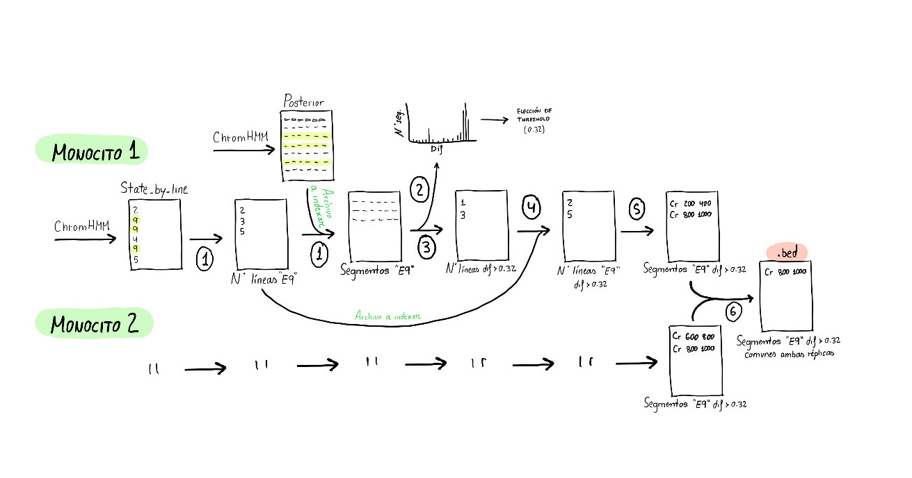
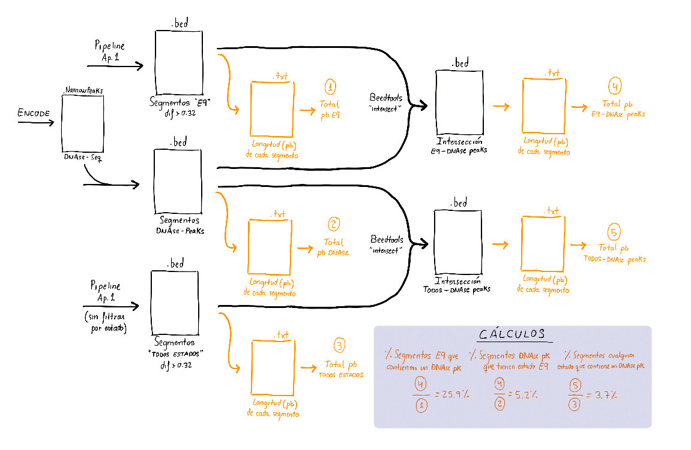

# Trabajo de Epigenómica - Grupo 5
###  Máster en Bioinformática y Biología Computacional, Universidad Autónoma de Madrid
### Curso Académido 2019-2020 
Análisis de estados de cromatina mediante segmentación: *Multivariate Hidden Markov Model* (resultados con ChromHMM). Este trabajo está centrado en el **estado 9 - CTCF**. 

AUTORAS:
  * **Silvia García Cobos**
  * **Rosalía Palomino Cabrera**
  * **Ana Rodríguez Ronchel**
  * **Lucía Sánchez García**
  * **Silvia Talavera Marcos**  

Este repositorio contiene los scripts utilizados en los diferentes apartados del trabajo. 

### Apartado 1
*Obtener los segmentos que tengan el mismo estado en los dos replicados de monocitos.*

Scripts:

**1_1_Filtrar_segmentos_E9.sh**: este script procesa los archivos "POSTERIOR" generados por ChromHMM y genera nuevos archivos con el mismo formato pero que contienen solo los segmentos asignados al estado 9.
**1_2_Generar_grafica_densidad.ipynb**: este script permite ver la distribución de las diferencias entre la dos probabilidades de estado más altas asignadas a cada segmento por el programa ChromHMM (diseñado para analizar datos de ChIP-Seq). En este caso se llevará a cabo sobre archivos previamente filtrados con el script **1_1_Filtrar_segmentos_E9.sh** que contienen solo los segmentos cuyo estado más probable es el 9.  
**1_3_Filtrar_032_archivos_indices.ipynb**: este script permite la generación de ficheros que contienen el número de línea de aquellos segmentos de los archivos "posterior_state_9_chr" en los que la diferencia de probabilidades entre el estado 9 (E9) y el segundo estado más probable es superior a 0.32.  
**1_4_Generar_archivos_filtrados_E9_032.sh**: este script procesa los archivos de índices de aquellos segmentos cuyo estado mayoritario es el estado 9 y en los que además, la diferencia de probabilidades entre el estado 9 y el siguiente estado más probable es mayor de 0.32.  
**1_5_Generar_ficheros_bed.sh**: este script permite generar los ficheros con formato BED de los segmentos de interés (cuyo estado mayoritario es el 9 y en los que además, la diferencia entre el estado 9 (mayoritario) y el siguiente más probable es mayor de 0.32). Los ficheros generados contienen 3 columnas:  
1. Número de cromosoma. 
2. Sitio (pb) de inicio del segmento. 
3. Sitio (pb) de fin del segmento.  

**1_6_Interseccion_replicas.sh**: este script realiza la intersección entre los archivos (Estado 9 y filtrados según diferencia de probabilidad con el segundo estado > 0.32) de los monocitos 1 y 2 para cada cromosoma.  

> **Esquema del procedimiento seguido para filtrar los segmentos.** Los números que acompañan a las flechas hacen referencia a los scripts utilizados en cada caso. 1) Generación de un archivo con los números de línea de aquellos segmentos asignados como E9 utilizado a continuación para indexar el archivo “Posterior” generado por ChromHMM y seleccionar solo dichos segmentos (*1_1_Filtrar_segmentos_E9.sh*). 2) Generación de la gráfica de distribución de diferencia de probabilidades a partir de la cual se estableció el threshold de 0.32 (*1_2_Generar_grafica_densidad.ipynb*). 3) Generación de un archivo con los números de líneas de aquellos segmentos previamente seleccionados que superasen el threshold (*1_3_Filtrar_032_archivos_indices.ipynb*). 4) Indexación del archivo que contenía los números de líneas de los segmentos E9 con el nuevo archivo generado (*1_4_Generar_archivos_filtrados_E9_032.sh*). 5) Generación de archivos en formato “bed” (*1_5_Generar_ficheros_bed.sh*). 6) Intersección de los archivos generados para cada monocito y generación de un nuevo fichero con los segmentos comunes a ambos para cada cromosoma y un archivo común con los segmentos de todos los cromosomas (*1_6_Interseccion_replicas.sh*).

   
 

### Apartado 2

*Anotar los segmentos. Como mínimo, se deberá dar el porcentaje de segmentos que solapan con protein-coding genes en dicho cromosoma.*

Scripts:

**2_1_Anotaciones_E9.R**: este script permite anotar los segmentos con Estado 9 previamente seleccionados tras el filtrado (diferencia de probabilidad posterior con el segundo estado más probable > 0.32). Utiliza el paquete en R **annotatr**. Las anotaciones realizadas corresponden a *'hg19_cpgs', 'hg19_basicgenes', 'hg19_genes_intergenic', 'hg19_genes_intronexonboundaries', 'hg19_genes_cds'*.  
**2_2_Anotaciones_todos_estados.R**: este script utilizando el mismo paquete en R (annotatr), anota los segmentos de 200pb de todos los cromosomas.  
**2_3_Calculo_porcentajes.sh**: este script nos permite calcular el porcentaje de segmentos que solapan con *protein-coding genes*.  
**2_4_Obtencion_frecuencias_segmentos.sh**: este script permite calcular la frecuencia de las diferentes anotaciones (annotatr) en los segmentos con estado 9 solapantes con *protein-coding genes*.   
**2_5_Obtencion_frecuencias_segmentos_todos_estados.sh**: este script permite calcular la frecuencia de las diferentes anotaciones (annotatr) en los segmentos para todos los estados solapantes con *protein-coding genes*.
**2_6_Grafica_anotaciones_segmentos.ipynb**: este script permite la realización de un histograma para visualizar la frecuencia de cada una de las anotaciones asociadas a los segmentos de interés (segmentos de 200 pares de bases, con estado E9 y filtrados)
**2_7_Grafica_anotaciones_segmentos_todos_estados.ipynb**: este script permite la realización de un histograma para visualizar la frecuencia de cada una de las anotaciones asociadas al genoma entero.  
**2_8_Grafica_CDS_cromosoma.ipynb**: este script permite calcular la frecuencia de segmentos en estado E9 y filtrados solapantes con *protein-coding genes* (CDS).  

### Apartado 3

*Descargar los picos de DNase I en monocitos de ENCODE y calcular el porcentaje de solapamiento entre DNaseI-peaks y vuestros segmentos de trabajo. Usad el fichero wgEncodeOpenChromDnaseMonocd14Pk.narrowPeak.gz en: http://hgdownload.cse.ucsc.edu/goldenpath/hg19/encodeDCC/wgEncodeOpenChromDnase/*

Scripts:  

**3_1_solapamiento_E9.sh**: este script realiza la intersección entre el archivo de segmentos con estado 9 y filtrados (diferencia de probabilidad con el segundo estado más probable > 0.32) y el archivo con segmentos de picos de DNasa I. Además calculamos a cuántos nucleotidos corresponden esos segmentos.  
**3_2_filtro_y_solapamiento_todos.sh**: este script procesa los archivos con segmentos para todos los estados en los que la diferencia entre el estado mayoritario y el siguiente más probable es > 0.32.  
**3_3_compare.py**: este script ordena los valores de cada línea en un archivo dado.  

> **Esquema del procedimiento seguido para calcular los porcentajes de solapamiento.** Calculamos tanto la proporción de pares de bases presentes en segmentos en estado 9 solapantes con segmentos de picos de DNase-seq como el dato complementario (porcentaje de picos de DNase-seq solapantes con regiones E9). Primero obtenemos un .bed a partir del archivo NarrowPeaks. No fue necesario el filtrado de segmentos porque todos tenían un -log10(p-value)>=1.30. A continuación usamos Bedtools intersect y obtenemos la intersección de segmentos E9 y picos de DNase-seq. Finalmente obtenemos la longitud en pb de todos los segmentos de E9 y de los segmentos de E9 que coinciden con picos de DNase y calculamos el porcentaje de pb de regiones coincidentes. Un procedimiento similar al utilizado en el primer apartado de este trabajo se usó para obtener todos los estados asignados con seguridad (es decir, que pasan los dos filtros pero sin seleccionar solo el estado 9). A partir de este archivo obtuvimos el porcentaje de solapamiento general para comparar con los mismos pasos

   
 

### Apartado 4

*Visualizar (y mostrar) una región del genoma en el UCSC browser donde se vean al menos uno de vuestros segmentos (subid el track generado por ChromHMM) y la DNase I en todos los tipos celulares de ENCODE de sangre.*

*No hay scripts para el análisis realizado en este apartado pues se basó en la visualización en UCSC Genome Browser.*  

### Apartado 5 (opcional I)

*Búsqueda de motivos enriquecidos.*

Scripts:

**5_1_from_bed_to_fasta.sh**: este script permite la conversión de los archivos .bed a .fasta para posteriormente llevar a cabo la búsqueda de motivos con el programa MEME (MEME-ChIP).  
**5_2_Homer.sh.sh**: este script realiza la búsqueda de motivos en los segmentos incluidos en un archivo .bed mediante el programa findMotifsGenome.pl de Homer.

### Apartado 6 (opcional II)

*Calcular el % de solapamiento con regiones hyper- (Metilación > 0.75) o hypo-metiladas (Metilación < 0.25) en monocitos disponibles en el DCC portal de BLUEPRINT. (http://dcc.blueprint-epigenome.eu/#/home) Ficheros BED pertenecientes al donante C001UY.*

Scripts:

**6_1_metilacionADN.sh**: este script permite calcular el porcentaje (en segmentos y pb) de solapamiento de segmentos con estado 9 (en los dos monocitos) y filtrados (diferencia de probabilidad posterior con el segundo estado mas probable >0.32) con regiones hiper- e hipo-metiladas de monocitos del donante C001UY. Además, permite realizar la intersección de segmentos con estado 9 y filtrados, previamente solapados con picos de DNasa I (script *3_1_solapamiento_E9.sh*), con regiones hiper- e hipo-metiladas de monocitos del donante C001UY.  
**6_2_anotacion_metilacionADN_CpG.R**: este script permite la ANOTACIÓN de islas CpG (regiones con alta concentración de citosinas y guaninas) y estructuras genéticas asociadas (*'inter-CGI',  'CpG shores', 'CpG shelves'*) en segmentos con estado 9 (previamente filtrados y coincidentes en los dos monocitos) que solapan con regiones hiper- e hipo-metiladas de monocitos del donante C001UY. Utiliza el paquete en R **annotatr**.  

### Apartado 7 (*adicional*)

*Estudiar la correlación entre el número de segmentos con estado 9 y el número de protein-coding genes.* 

Script:

**7_Relacion_genes_longitud_CTCF.ipynb**: La primera parte de este script muestra la correlación existente entre el número de segmentos con estado 9 y el número de genes presentes en cada cromosoma. En una segunda parte se analiza la correlación existente entre el número de segmentos con estado 9 y la longitud de los cromosomas.  

### Apartado 8 (*adicional*)

*Detección de procesos biológicos asociados a la unión de CTCF.*

Script:

**8_procesos_biologicos.R**: este script permite el análisis y visualización de perfiles funcionales de coordinadas genómicas, genes y grupos de genes. 

## Software utilizado

* [Python](https://www.python.org)
* [R](https://www.r-project.org)
* [annotatr](https://www.bioconductor.org/packages/release/bioc/html/annotatr.html) 
* [HOMER Motif Analysis](http://homer.ucsd.edu/homer/motif/)
* [MEME-Suite](http://meme-suite.org)
* [clusterProfiler](https://github.com/YuLab-SMU/clusterProfiler)
* [AnnotationDbi](https://bioconductor.org/packages/release/bioc/html/AnnotationDbi.html)
* [org.Hs.eg.db](https://bioconductor.org/packages/release/data/annotation/html/org.Hs.eg.db.html)

